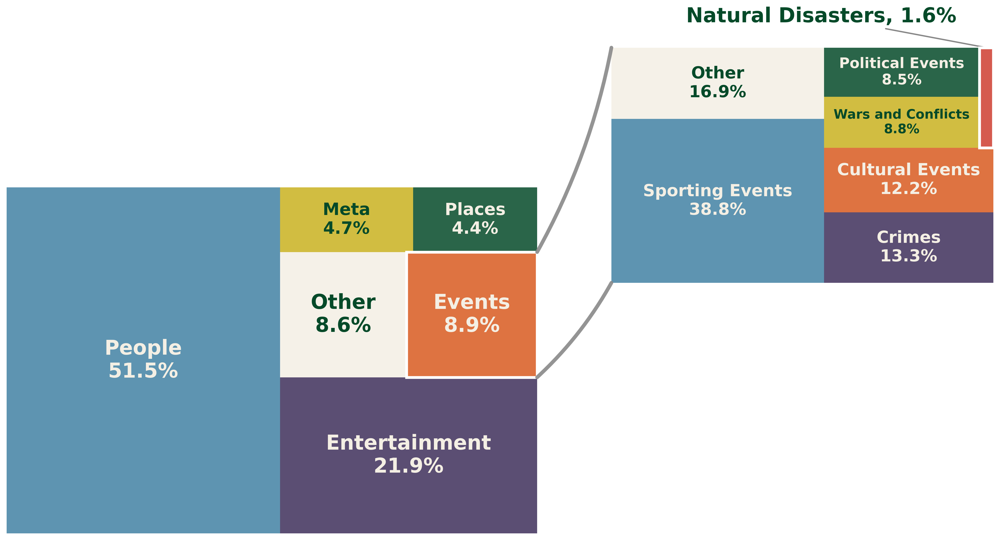
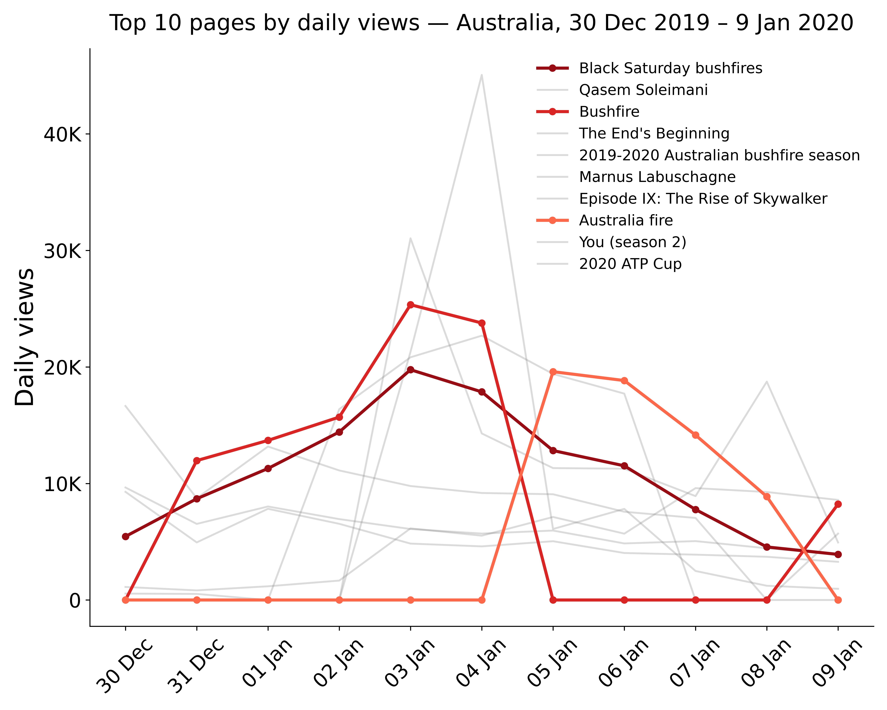
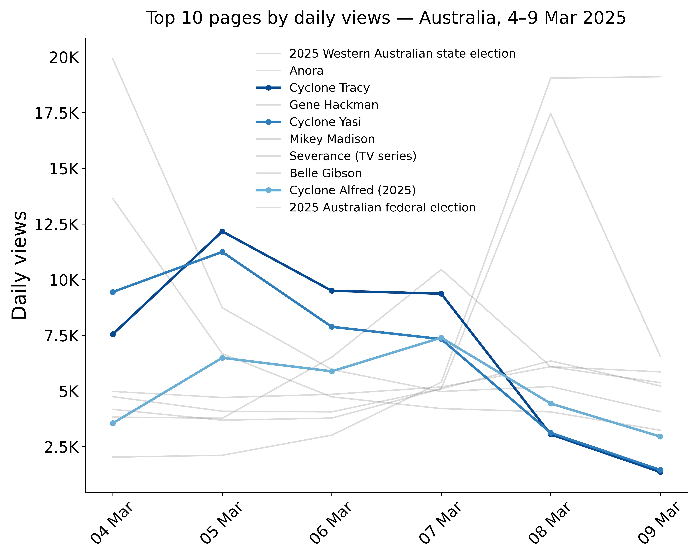
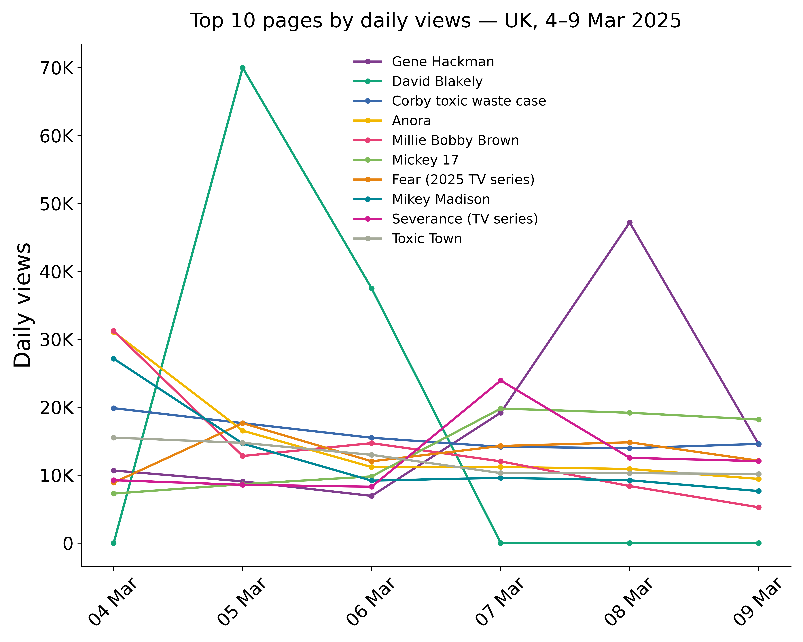
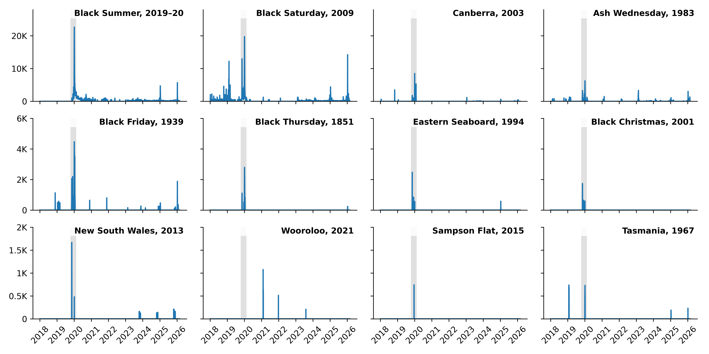
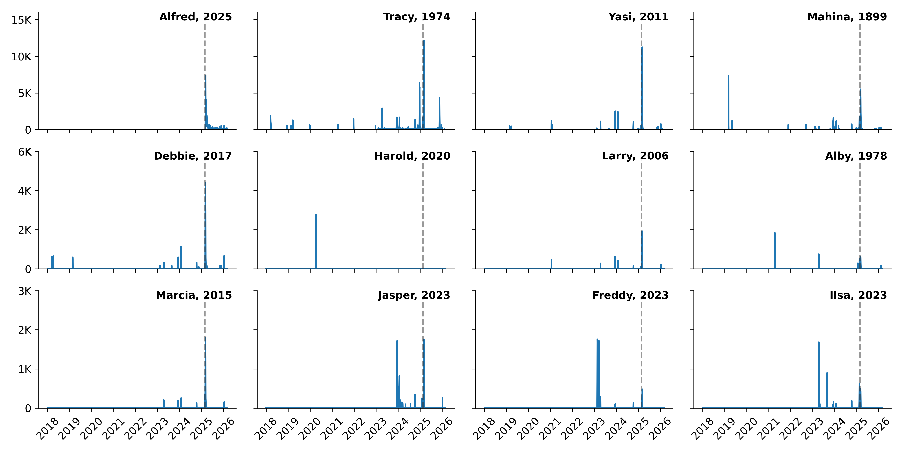
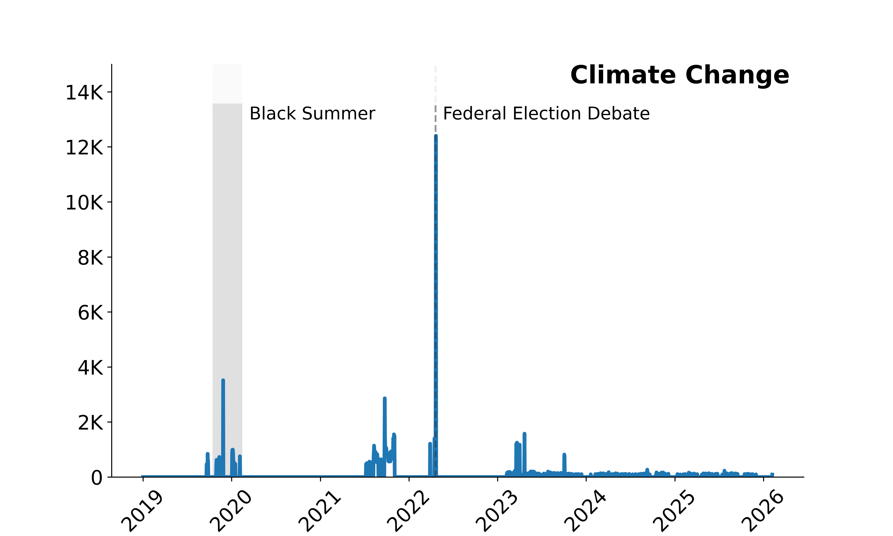

# wikihistories | events | data analysis

This project examines how people in Australia use Wikipedia to understand unexpected events, with a particular focus on natural disasters. It is part of the broader [wikihistories](https://wikihistories.net/) project led by Prof. [Heather Ford](https://profiles.uts.edu.au/Heather.Ford) and supported by ARC Discovery Projects Grant №220100662.

The data analysis for this sub-project was performed by Dr [Ivan Smirnov](https://smirnov.au).

Instructions for reproducing the findings and data visualisations are available in [reproduction document](reproduction.md).

## Australian Wikipedia Pageviews

We analysed Wikipedia pageviews originating from Australia between 9 February 2017 and 28 February 2026. This temporal range combines two of Wikimedia's public data releases: the [historical differentially private daily pageview dataset](https://analytics.wikimedia.org/published/datasets/country_project_page_historical/00_README.html), which covers 9 February 2017 to 5 February 2023, and the [current release](https://analytics.wikimedia.org/published/datasets/country_project_page/00_README.html), which covers 6 February 2023 onward.

The targeted date range spans 3,307 calendar days. Our compiled source dataset contains 3,302 daily files, yielding 11,400,279 individual Australia-specific pageview rows following country extraction. This dataset is missing 5 raw source days: 26 June 2017, 24 July 2017, 19 July 2020, 20 July 2020, 19 October 2022.

After excluding the Main_Page, the final analysed dataset comprises 4,263,461,008 pageviews across 296,668 unique Wikipedia pages, averaging 1,291,175 pageviews per available day.

Because country-level data features a high degree of granularity, the Wikimedia Foundation publishes this dataset using [differential privacy](https://meta.wikimedia.org/wiki/Differential_privacy/Completed/Country-project-page) mechanisms. In practice, controlled statistical noise is injected into the data prior to release. This framework protects readers from individual re-identification while preserving aggregate semantic and traffic patterns. Consequently, the published counts should be interpreted as privacy-protected estimates rather than exact traffic totals.

**Note**: The visible increase in overall daily views following the transition from the historical release to the current release is methodological. The historical dataset only includes rows that exceeded a threshold of 450 daily views, while the current release uses a significantly lower threshold of 90 daily views for low-risk countries such as Australia. This lower threshold means more lower-traffic pages enter the public dataset after 5 February 2023, increasing the total count.

Generally, the dataset includes pages from all Wikipedia projects. However, 95.0% of pages are from the English Wikipedia (en.wikipedia), followed by the Chinese Wikipedia (the Wikipedia language edition that uses written vernacular Chinese, zh.wikipedia) with 2.5% of pages. The same pattern holds for pageviews, with the English Wikipedia responsible for 98.6% of views and the Chinese Wikipedia for 0.3%.

We categorised Wikipedia pages using methodology specifically developed for this project. See the [categorisation documentation](categorisation.md) for details. The resulting distribution of views per category is shown in the following figure, with Natural Disasters accounting for 0.14% of all pageviews.

## Natural Disaster Views

Even though natural disasters overall are responsible for only a fraction of a percent of Australian views (0.14%), when a disaster strikes, articles related to the event become some of the most viewed Wikipedia pages.

For example, during the peak of Australia’s 2019-2020 bushfire season, bushfire related pages were the first, third and the fifth most viewed pages.

Articles about cyclones demonstrate similar trends. For example, when Cyclone Alfred turned towards Queensland on the 4th of March 2025, the corresponding Wikipedia page was among 10 most viewed pages in Australia.

Note that these results are local to Australia. For comparison, while “Anora” also features in 10 most viewed pages in the UK during the same period, the cyclone-related pages are not present.

When natural disasters strike, readers learn not only about the immediate event but also about its historical context. The figures below show that during two of the most significant recent natural disasters — the “Black Summer” bushfires of 2019–2020 (shaded region) and Cyclone Alfred in 2025 (dashed line) — readership for past events in the same category also spiked.

Similarly, readers explore the broader context in which these events occur. For example, during the 2019–20 Black Summer bushfires, the “Climate change” article recorded its second-highest readership peak among Australian readers.

