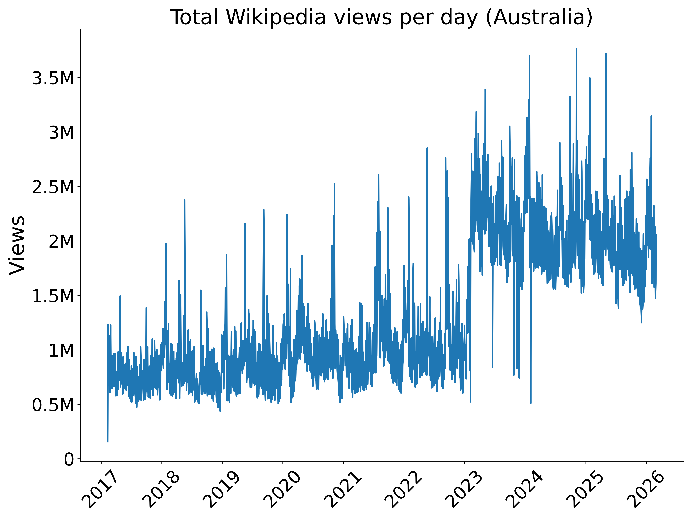

# wikihistories | events | data analysis

This project examines how people in Australia use Wikipedia to understand unexpected events, with a particular focus on natural disasters. It is part of the broader [wikihistories](https://wikihistories.net/) project led by Prof. [Heather Ford](https://profiles.uts.edu.au/Heather.Ford) and supported by ARC Discovery Projects Grant №220100662.

The data analysis for this sub-project was performed by Dr [Ivan Smirnov](smirnov.au).

Instructions for reproducing the findings and data visualizations are available in [reproduction document](reproduction.md).

## Australian Wikipedia Pageviews

We analysed Wikipedia pageviews originating from Australia between 9 February 2017 and 28 February 2026. This temporal range combines two of Wikimedia's public data releases: the [historical differentially private daily pageview dataset](https://analytics.wikimedia.org/published/datasets/country_project_page_historical/00_README.html), which covers 9 February 2017 to 5 February 2023, and the [current release](https://analytics.wikimedia.org/published/datasets/country_project_page/00_README.html), which covers 6 February 2023 onward.

The targeted date range spans {australia_pageviews.expected_days} calendar days. Our compiled source dataset contains {australia_pageviews.files_found} daily files, yielding {australia_pageviews.australia_pageview_rows} individual Australia-specific pageview rows following country extraction. This dataset is missing {australia_pageviews.missing_days_number} raw source days: {australia_pageviews.missing_days}.

After excluding the Main_Page, the final analysed dataset comprises {australia_pageviews.total_views} pageviews across {australia_pageviews.unique_pages} unique Wikipedia pages, averaging {australia_pageviews.daily_average_views} pageviews per available day.

Because country-level data features a high degree of granularity, the Wikimedia Foundation publishes this dataset using [differential privacy](https://meta.wikimedia.org/wiki/Differential_privacy/Completed/Country-project-page) mechanisms. In practice, controlled statistical noise is injected into the data prior to release. This framework protects readers from individual re-identification while preserving aggregate semantic and traffic patterns. Consequently, this means the published counts should be interpreted as privacy-protected estimates rather than exact traffic totals.

**Note**: The visible increase in overall daily views following the transition from the historical release to the current release is methodological. The historical dataset only includes rows that exceeded a threshold of 450 daily views, while the current release uses a significantly lower threshold of 90 daily views for low-risk countries such as Australia. This lower threshold means more lower-traffic pages enter the public dataset after 5 February 2023 increasing total count.

